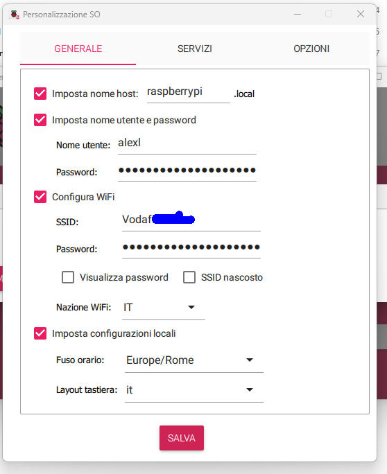
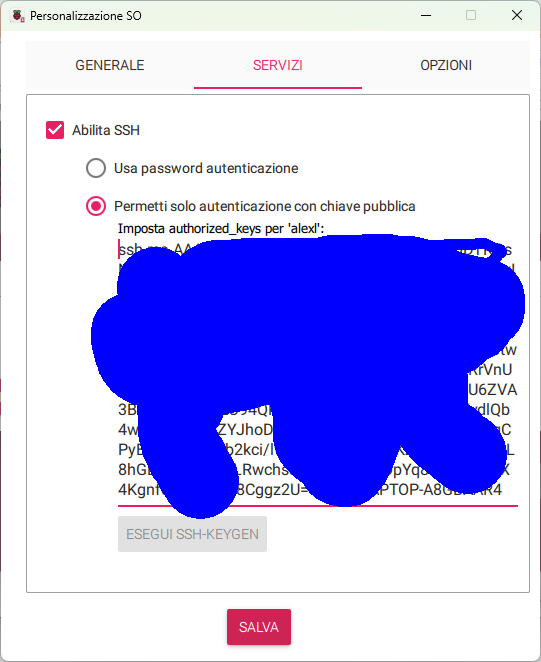

Screen time parental control for tv/console

📂 Table of Contents

- [About](#about)
- [Telegram Bot and chat](#telegram-bot-and-chat)
  - [🤖 Avalable commands](#-avalable-commands)
  - [🤖 How to create a Telegram BOT](#-how-to-create-a-telegram-bot)
  - [📱 How to get the Chat ID](#-how-to-get-the-chat-id)
- [Raspberry Pi Zero W](#raspberry-pi-zero-w)
  - [Prepare an SD card with a Raspberry Pi OS image (so you can boot it).](#prepare-an-sd-card-with-a-raspberry-pi-os-image-so-you-can-boot-it)
  - [Connecting to raspberry pi via SSH in Ms Windows](#connecting-to-raspberry-pi-via-ssh-in-ms-windows)
  - [Create the “venv” Virtual environment for python](#create-the-venv-virtual-environment-for-python)
  - [Use venv](#use-venv)
  - [create a .env file with the credentials of the services](#create-a-env-file-with-the-credentials-of-the-services)
  - [create a "usersMQTT.json" file with the data of the users](#create-a-usersmqttjson-file-with-the-data-of-the-users)
  - [create a "calendarMQTT.json" file with the data of the users](#create-a-calendarmqttjson-file-with-the-data-of-the-users)
  - [Copy files from Ubuntu to Raspberry Pi](#copy-files-from-ubuntu-to-raspberry-pi)
  - [Copy files from Ms Windows to Raspberry Pi](#copy-files-from-ms-windows-to-raspberry-pi)
  - [Copy the file to the right folder from an ssh session connected ot the Raspberry Pi](#copy-the-file-to-the-right-folder-from-an-ssh-session-connected-ot-the-raspberry-pi)
  - [Use systemD to start the script at boot:](#use-systemd-to-start-the-script-at-boot)
  - [optimizing power consumption](#optimizing-power-consumption)
    - [turn off USB port](#turn-off-usb-port)
    - [Disable Bluetooth](#disable-bluetooth)
    - [Disable HDMI](#disable-hdmi)
    - [Disable On-Board LEDs](#disable-on-board-leds)
    - [lower clock frequency](#lower-clock-frequency)

# About 
The televison and the console are powered by a smart plug. The smart plug is turned off after a certain daily limit of minutes has been reached or outside allowed time slots(30 mins each) ranging from 7:30 am to midnight. My smart plug powers a television and a playstation 5.

"TvTelegramBotMQTT.py" runs in a Raspberry Pi Zero W, four Tasmota plugs (Refoss P11) and uses the messaging app Telegram to communicate with the user.

"TvTelegramBot.py" runs in a Raspberry Pi Zero W, a Meross smart plug (MSS310R) and uses the messaging app Telegram to communicate with the user.

"TvTelegramBotMQTT.py" is more advanced because it manages 4 plugs and five users. The first plug is associated by default to the user "Manoel", if another users starts the plug and then stops it, the plug is assigned to "Manoel". Error minutes from any plugs are assigned to "Manoel" to decrease the risk of tampering. System uptime is shown to decrease the risk of tampering by turning off the Rasperry Pi.

The scripts are run at boot via systemd, so you just have to connect the Rapsberry Pi Zero W to the power supply. 

There is a maximum amount of minutes (available every day) that resets after midnight. 
The maximum amout of minutes and the time slots are saved to json files.

Every two minutes the power delivered by the smart plug is read and if it is greater than the threshold "powered_on_min_watts" the available amounts of minutes is decreased. The threshold is useful because the console can consume power whilst in stand-by.
Minutes can be added or subtracted durign the day but these changes are lost after midnight.
Every half hour the bot writes to telegram its status. If the smart plug is disconnected "error" minutes are added. 
The timeslots can be set for each week day. 
Every half hour the script posts to telegram a status message.

# Telegram Bot and chat

## 🤖 Avalable commands
the available commands are: addMinutes /help /pause /restart /kill /status /calendar /book /my_bookings /setDailyMinutes
- `/addMinutes `followed by a positive or negative number of minutes to sum to the maximum number of minutes. The following day the maximum number of minutes is restored
- `/status` gives you info about the state of the software and the available commands
- `/book` to edit daily time slots
- `/my_bookings` to see allowed time slots
- `/setDailyMinutes `followed by the maximum number of allowed minutes 
## 🤖 How to create a Telegram BOT

Open Telegram and search for @BotFather

Type `/start` and then `/newbot`

Choose a name for the bot (e.g., "Consolidation Detector Bot")

Choose a username (it must end with 'bot', e.g., "screen_time_bot")

BotFather will give you a TOKEN – SAVE IT!

## 📱 How to get the Chat ID

Stop the bot(otherwise it will consume the data before you can see it),
send a command to your bot(, if it is not a command the bot should be an
administrator to be able to read the message)

Open: \[https://api.telegram.org/bot\<TOKEN\>/getUpdates
\](*https://api.telegram.org/bot\<TOKEN\>/getUpdates*)

look for: "chat":{"id": NUMBER} – that’s your chat_id

# Raspberry Pi Zero W

## Prepare an SD card with a Raspberry Pi OS image (so you can boot it).

This is how you normally set up a fresh Pi:

- Download ****Raspberry Pi Imager**** from raspberrypi.com
- Install it on your PC (Linux, Windows, or macOS).

<!-- -->

- Insert your microSD card into the computer.

<!-- -->

- Open Raspberry Pi Imager → select OS (e.g. **Raspberry Pi OS
  64-bit**).

<!-- -->

- Select the SD card as storage.

<!-- -->

- Click ****Write**** → it flashes the OS image onto the SD card.

<!-- -->

- Insert SD card into the Pi and boot. Set WiFi and other details:

- Enable SSH:

In Raspberry Pi Zero W I have created the folders “tv” for the script
and "venvTv" for the Virtual environment

## Connecting to raspberry pi via SSH in Ms Windows

`ssh alexl@raspberrypi` or, less securely: `ssh -o
StrictHostKeyChecking=no alexl@raspberrypi`. If it gives an error and
does not ask you to add the client, delete the raspberrypi client in the
Windows file “C:\Users\alexl\\ssh\known_hosts”.

Once connected, use the following command if you want to disconnect:
`exit`

If you want to restart the raspberry: `sudo reboot`

## Create the “venv” Virtual environment for python

Connecting to the Raspberry pi via “ssh” (see previous chapter)

Create a virtual environment in the folder “venvTv”: `python3 -m venv venvTv`

navigate to the bin subfolder: `cd venvTv/bin`

activate the virtual environment: `source activate`

## Use venv

Once the virtual environment has been activated, Python usage proceeds
in the normal fashion. Running python or pip will be done in the context
of the virtual environment.

Modules installed with pip will be placed in the local “venv” folders
- **sudo should not be used**.

(venvTv) alexl@raspberrypi:~ \$ `pip install python-telegram-bot`

(venvTv) alexl@raspberrypi:~ \$ `pip install meross_iot==0.4.8.0`
installs the library to manage meross devices

(venvTv) alexl@raspberrypi:~ \$ `pip install dotenv`

(venvTv) alexl@raspberrypi:~ \$ `pip install paho-mqtt`
install the latest version compatible with Meross

(venvTv) alexl@raspberrypi:~ \$ `pip install aiomqtt`
Install the library to have async MQTT

## create a .env file with the credentials of the services
The .env files contain the IDs, passwords and tokens used to access the services.

- AUTHORIZED_USER_ID is the ID of the user who can send commands to the telegram bot
- "email" and "password" are the credentials that you use in the Meross App

.env file sample:
<pre>TELEGRAM_BOT_TOKEN=nnnnnnnnnn:xxxxxxxxxxxxxxxxxxxxxxxxxxxxxxxxxxx
TELEGRAM_BOT_TOKEN_MQTT=nnnnnnnnnn:xxxxxxxxxxxxxxxxxxxxxxxxxxxxxxxxxxx
EMAIL = "email_registered_with_meross@provider.com"
PASSWORD = "password_registered_with_meross"
AUTHORIZED_USER_ID = nnnnnnnnnn
AUTHORIZED_USER_ID_MQTT = 
chatID='-nnnnnnnnnn'
chatID_MQTT='-nnnnnnnnnn'</pre>
## create a "usersMQTT.json" file with the data of the users
<pre>{
  "100001": {
    "user_id": 100001,
    "username": "Manoel",
    "initial_minutes": 125,
    "remaining_minutes": 125
  },
  "100002": {
    "user_id": 100002,
    "username": "Alex",
    "initial_minutes": 125,
    "remaining_minutes": 125
  },
  "100003": {
    "user_id": 100003,
    "username": "user3",
    "initial_minutes": 125,
    "remaining_minutes": 125
  },
  "100004": {
    "user_id": 100004,
    "username": "user4",
    "initial_minutes": 125,
    "remaining_minutes": 125
  },
  "100005": {
    "user_id": 100005,
    "username": "user5",
    "initial_minutes": 125,
    "remaining_minutes": 125
  }
}</pre>
## create a "calendarMQTT.json" file with the data of the users
<pre>{
  "Mon": {
    "08:00": {
      "user_id": 100001,
      "username": "Manoel",
      "booked_at": "2025-09-19T23:05:36.284277"
    },
    "08:30": {
      "user_id": 100001,
      "username": "Manoel",
      "booked_at": "2025-09-19T23:05:36.284889"
    },
    "09:00": {
      "user_id": 100001,
      "username": "Manoel",
      "booked_at": "2025-09-19T23:05:36.289401"
    }
  },
  "Tue": {
    "20:00": {
      "user_id": 100001,
      "username": "Manoel",
      "booked_at": "2025-09-19T23:06:41.615729"
    },
    "20:30": {
      "user_id": 100001,
      "username": "Manoel",
      "booked_at": "2025-09-19T23:06:41.616601"
    }
  }
}</pre>
## Copy files from Ubuntu to Raspberry Pi
From terminal, without being connected through “ssh”:

alex@alex:~/Downloads$ `scp /home/alex/Documents/pythonProjects/Screen_time_limit_with_smart_plug/TvTelegramBotMQTT.py alexl@raspberrypi:tv
TvTelegramBotMQTT.py `

## Copy files from Ms Windows to Raspberry Pi

From poweshell, without being connected through “ssh”:

> PS C:\Users\alexl\> `scp "C:\Users\alexl\OneDrive\Documenti\pythonProjects\parental\TvTelegramBotMQTT.py" alexl@raspberrypi:tv`

> PS C:\Users\alexl\> `scp "C:\Users\alexl\OneDrive\Documenti\pythonProjects\parental\.env" alexl@raspberrypi:tv`

> PS C:\Users\alexl\> `scp "C:\Users\alexl\OneDrive\Documenti\pythonProjects\parental\calendarMQTT.json" alexl@raspberrypi:tv`

> PS C:\Users\alexl\> `scp "C:\Users\alexl\OneDrive\Documenti\pythonProjects\parental\configMQTT.json" alexl@raspberrypi:tv`

> PS C:\Users\alexl\> `scp "C:\Users\alexl\OneDrive\Documenti\pythonProjects\parental\tvTelegramMQTT.service" alexl@raspberrypi:tvTelegramMQTT.service`

alexl@raspberrypi:~ \$ `exit`

## Copy the file to the right folder from an ssh session connected ot the Raspberry Pi

- alexl@raspberrypi:~ \$ `sudo cp TvTelegramMQTT.service /lib/systemd/system/tvTelegramMQTT.service`

Giving rights to the file:

- alexl@raspberrypi:~ \$ `sudo chmod 644 /lib/systemd/system/tvTelegramMQTT.service`

It is a good idea to check if the files has been copied by going into the folders and listing their content

## Use systemD to start the script at boot:

[**https://learn.adafruit.com/python-virtual-environment-usage-on-raspberry-pi/automatically-running-at-boot**](https://learn.adafruit.com/python-virtual-environment-usage-on-raspberry-pi/automatically-running-at-boot)

alexl@raspberrypi:~ \$ `sudo systemctl daemon-reload`

alexl@raspberrypi:~ \$ `sudo systemctl enable TvTelegramMQTT`

alexl@raspberrypi:~ \$ `sudo systemctl start TvTelegramMQTT`

to check the status:

- alexl@raspberrypi:~ \$ `systemctl status TvTelegramMQTT.service`

to exit the status press “q”

to reboot:

- alexl@raspberrypi:~ \$ `systemctl status TvTelegramMQTT.service`

to stop the service:

- alexl@raspberrypi:~ \$ `sudo systemctl stop TvTelegramMQTT`

disable at startup:

- alexl@raspberrypi:~ \$ `sudo systemctl disable TvTelegramMQTT`

## optimizing power consumption

The source of the following information is "Rob Lauer", see webpage:  [**https://blues.com/blog/tips-tricks-optimizing-raspberry-pi-power/**](https://blues.com/blog/tips-tricks-optimizing-raspberry-pi-power/)

### turn off USB port

To shut off power on USB ports (this shuts power on ethernet as well):  
`echo '1-1' \| sudo tee /sys/bus/usb/drivers/usb/unbind`
  
To turn power back on  
`echo '1-1' \| sudo tee /sys/bus/usb/drivers/usb/bind`

### Disable Bluetooth

Once again there are a number of ways to do this. The easiest way is to
utilise the program \| rfkill \| again. Type the following into the
terminal and press enter for each line (if you have already installed
rkill you will not need to reinstall it). Then on reboot it will be
disabled.

`sudo apt install rfkill`  
`sudo rfkill block bluetooth`  

If you want to re-enable Bluetooth simply type the following into the
terminal.

`sudo rfkill unblock bluetooth`

### Disable HDMI

Whenever you are remotely accessing the Raspberry Pi using SSH or
running it headless then likely there will be no need to run anything
through the onboard HDMI ports. This means you can disable power to
these ports which will give a small improvement to battery life (~20mA).
Type the following into the terminal to disable power to the HDMI ports.
As soon as you press enter it will be disabled.

- `sudo /opt/vc/bin/tvservice -o`

If you want to re-enable HDMI connection simply type the following into
the terminal.

- `sudo /opt/vc/bin/tvservice -p`

### Disable On-Board LEDs

The LEDs are a very small power draw and give a good indication visually
on the board as to what the Raspberry Pi Board is doing. However, if you
have the Raspberry Pi tucked away in a hidden place or covered in a case
then likely there will be no need to run the LEDs as nobody will see
them. It also means a running Raspberry Pi will appear to be not powered
which could make for some sweet stealthy spy electronic projects. So by
disabling power to the LEDs you will gain a small improvement to overall
battery life (\<2mA potential saving per LED). To do this edit
the /boot/config.txt file and add the following lines (when using a
Raspberry Pi 4 Model B). Save the file and then on reboot the lights
will be disabled. To return the LED lights to normal remove the added
lines.

<pre>dtparam=act_led_trigger=none

dtparam=act_led_activelow=off

dtparam=pwr_led_trigger=none

dtparam=pwr_led_activelow=off</pre>

### lower clock frequency

file to be edited: `sudo nano /boot/firmware/config.txt`

Modifiy in :`arm_boost=0`

Add below `[all]` :

<pre>arm_freq=600

arm_freq_max=600</pre>

comment the row: `dtparam=audio=on`
